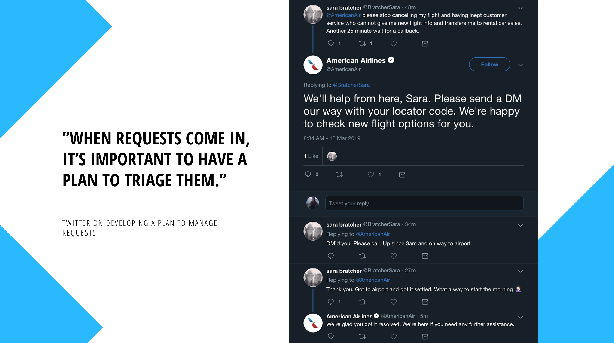
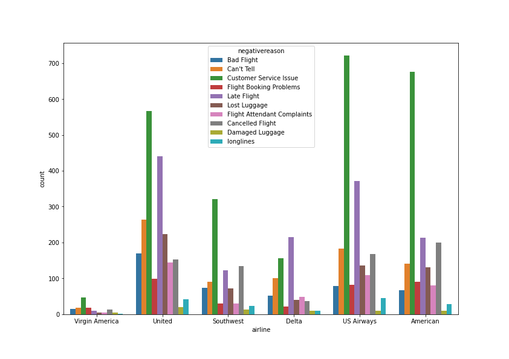

<a href="http://fvcproductions.com"></a>

# Customer Service Sentiment Prediction

## Business challenge 

For small teams with limited or no customer service staff receiving customer service tweets directed towards them regularly. 
Repeated delay or bad customer service can result in a decrease in brand value over time. Can we help reduce tweet response time by creating a model that correctly classifies sentiment of each tweet? If so, the model can then be used for intelligent email routing, routing each tweet to the appropriate contact or department based on sentiment polarity and priority, using automation to limit the time it takes for the message to be received. For this reason, I believe this is an impactful business problem that warrants solving. 

## Quantifying business value 

Metrics should be
- Easily measurable 
- Directly correlated to busienss performance 
- Predictive of future business outcomes
- Isolated to factors controlled by the group it's measuring 
- Comparable to competitor's metrics 
    Outcome 
        - Customer experience?
        - Revenue gain?
        - Customer engagement?
        - Business process automation?
        - Better & faster decision making?
    Output
        - Model accuracy?
        - Execution time
        - Recall 
        - Precision

* Classified CS tweets by sentiment
* Improved response time by x days
* Improve CS satisfaction 

## Addressing Unwanted Bias 
    Awareness 
        - Sentiment classification 

## Large volume of associated data?

## The Data 

A tweet contains a lot of opinions about the data which are
expressed in different ways by different users .The twitter
dataset used in this survey work is already labeled into two
classes viz. negative and positive polarity and thus the
sentiment analysis of the data becomes easy to observe the
effect of various features

- How much data do you have? 
- Does the dataset match the problem? 
- Is the dataset complete?
- Is the data annotated correctly for ML?

## Further identifying the AI value 

## Project statement

## Narrowing the business problem: 

## EDA 

## Models to use, why 
## Model evaluation 

--
### Preprocessing of the dataset
The raw data having polarity is highly susceptible to inconsistency and redundancy.
Preprocessing of tweet include following points,
     Remove all URLs (e.g. www.xyz.com), hash tags (e.g.
    #topic), targets (@username)
     Correct the spellings; sequence of repeated characters is to
    be handled
     Replace all the emoticons with their sentiment.
     Remove all punctuations ,symbols, numbers
     Remove Stop Words
     Expand Acronyms(we can use a acronym dictionary)
     Remove Non-English Tweets

### Feature Extraction

The preprocessed dataset has many distinctive properties. 
In the feature extraction method, we extract the aspects from the processed dataset. 
Later this aspect are used to compute the positive and negative polarity in a sentence which is useful for determining the opinion of the individuals using models like unigram, bigram [18]. Machine learning techniques require representing the key features of text or documents for processing. These key features are c o n s i d e r e d as feature vectors which are used for the classification task..Some examples features that havebeen reported in literature are:

1. Words And Their Frequencies:
Unigrams, bigrams and n-gram models with their frequency
counts are considered as features. There has been more
research on using word presence rather than frequencies to
better describe this feature. Panget al. [23] showed better
results by using presence instead of frequencies.
2. Parts Of Speech Tags
Parts of speech like adjectives, adverbs and somegroups of
verbs and nouns are good indicators of subjectivity and
sentiment. We can generate syntactic dependency patterns by
parsing or dependency trees.
3. Opinion Words And Phrases
Apart from specific words, some phrases and idioms which
convey sentiments can be used as features.
e.g. cost someone an arm and leg.
4. Position Of Terms
The position of a term with in a text can affect on how much
the term makes difference in overall sentiment of the text.
5. Negation
Negation is an important but difficult feature to interpret. The
presence of a negation usually changes the polarity of the
opinion..
e.g., I am not happy.
6. Syntax
Syntactic patterns like collocations are used as features to
learn subjectivity patterns by many of the researchers.


Total Data x 
Total US airlines x 
Total users x 


Using sentiment analysis, analyze the information in all tweets directed towards major US airlines between the months in 2015, and develop a classification model  the tweets where opinions are highly unstructured, heterogeneous and are either positive or negative, or neutral in some cases


The following sentiment analysis analyzes all the interactions between top US airlines brands on Twitter between months and , in 2015.  helpful to analyze the information in
the tweets where opinions are highly unstructured,
heterogeneous and are either positive or negative, or neutral in
some cases

Sentiment Analysis is a term that include many tasks such as
sentiment extraction, sentiment classification, subjectivity
classification, summarization of opinions or opinion spam
detection, among others. It aims to analyze people's sentiments,
, attitudes, opinions emotions, etc. towards elements such as,
products, individuals, topics ,organizations, and services. 

>sentiment extraction, data cateogrization/classification, sentiment classification, subjectivity classification, summarization of opinions, subjectivity analysis, opinion mining, and appraisal extraction.

> Predicting customer emotion in on-line service interactions. We look into the sentiment of customer service twitter messages directed toward the top U.S airlines. 
> Tags: Text Classification, Sentiment Analysis, NLP, NLTK, Scikitlearn

 

## Twitter Triage

When it comes to managing customer service interactions on Twitter, the platform can be unforgiving. If your reps aren't equipped to handle customer demand, or aren't sure how to communicate on Twitter, it may harm your customer experience and lead your brand to receive upset followers. 

When requests come in through Twitter, it’s important to have a plan to triage them. The brands that are thriving in social customer care on Twitter (Amazon, Buffer, Starbucks, UPS) have common characteristics where you'll find their replies to be prompt, unique, signed, and helpful. 

## Project Scenario

In any customer service scenario on Twitter, friendliness and personalization are just as important as speed. Brands incorporating these practices into their Twitter customer service, often have positive results. 

With regard to speed, can we build a model that aids a team in decreasing the time needed to respond to an initial customer service message. We are using a dataset containing 14,000 customer service tweets labeled by emotional polarity data to speed response time for customer service tweets. 

## Project Structure

The data for this project is available in the following structure of the repo:
```
├── _data
│   ├── raw_data
│   │   ├── Tweets.csv
```
For now, we will use 80% of it as training set and the remaining 20% as the test set. They are both available in `/data/processed` as `train.csv` and `test.csv`. 

If you're more business oriented, I recommend viewing either the presentation pdf or the Readme for overlay and outcomes of the project. 

```
├── README.md 
```

```
├── Presentation.pdf
```

If on the technical side, please check out:

```
└───_code/
│       └───exploration/
│           │   01_data_exploration.ipynb
│       └───acquisition/
│           │   Feat_data.ipynb
│           │   Preprocessing.ipynb
│       └───modeling/
│           │   Modeling.ipynb
```

---
## Table of Contents (Readme)

> If your `README` has a lot of info, section headers might be nice.

- [Business Understanding](#business-understanding)
- [Project Scenario](#project-scenario)
- [Limitations](#limitations)
- [Project Goals](#project-goals)
- [Approach](#approach)
- [Data](#data)
- [EDA](#eda)
- [Modeling](#modeling)
- [Evaluation Metrics](#evaluation-metrics)
- [Next Step Future Work](#nextstep-futurwork)
- [References](#references)

---

## Business Understanding

For some people Twitter is the first place they go to for customer service. It may be about problems, complaints they need addressed, questions answered, or saying Thank You for service and support. Twitter's research has found that users are most likely to use Twitter as a customer service channel for retail and travel. As many as 40% of those who recently used the platform for customer service had done some for retail; 33% for travel and 28% for telecoms[1]. 

Twitter has found that 71% of Twitter users expect a brand to respond to their query within an hour of Tweeting. For most companies, this hasn't proven to be an issue. Twitter's study showed that 63% of users who Tweeted a brand about customer service had a response within an hour. Over a third of them had a response within 30 mins. It's imperative therefore for brands who don't have quick response times to develop systems in place to continuously meet customer service demands. 

## Project Goals

(1) To better understand customer service sentiment of US airlines on TWitter.

(2) Develop a model that automatically detects customer emotional polarity in on-line service interactions with an accuracy of at least 90% and to show that good prediction is possible. 

## Approach

In this project, the target variable that represents the emotional parity is 'airline sentiment' which can be either negative, netural, or positive. I later turned the classification to binary as negative or positive to reduce noise generated from neutral. The data shrinks from it's original size of 14k to approximately 10k after re-classification. 
Tweets labeled as positive make up approximately 20 percent of the target variable. 
<br />
<br />

<br />
<br />

Once the text of a tweet is received, we want to create a model that predicts if the message is negative or positive so that we can automatically distinguish between high and low priority messages and delegate accordingly.  

Before we train a model, we need to perform pre-processing on the text and feature engineer  
Said data to properly feed to our ML model for interpretation. A later section explains the process taken in fuller detail. 

## Data 

The data was scraped by CrowdFlower (now Figure Eight, a ML company) which includes all tweets and its corresponding messages addressed at US airlines in February, 2015. Human contributors then categorized each tweet according to the sentiment (positive, negative) from a crowdsource marketplace. The dataset is hosted on Kaggle, https://www.kaggle.com/crowdflower/twitter-airline-sentiment. 

## EDA

### Missing values, outliers, low importance features? 
- Missing values count
- No outliers found
- Low importance features: 
    - `tweet_id`: no significance 
    - `airline_sentiment_gold`: unable to determine value.
    - `name`: no significance. 
    - `negativereason_gold`: unable to determine value.
    - `retweet_count`: less than 1% of tweets contain at least 1 retweet.
    - `tweet_coord`: little signifiance. 
    - `tweet_created`: time series is not being done.
    - `tweet_location`: little signifiance.  
    - `user_timezone`: little significance. 

### Negative Reasons by Airline 

The 'negative reasons' column of the dataset includes 10 different reasons of a label being labeled negative. If a labeler labeled the tweet as being negative, they had the option of including a reason. Of the total 14k dataset, 5.4k messages include a negative reason. The negative reasons include: Bad flight, Can't tell, Customer service issue, Flight booking problems, Late flight, Lost luggage, Flight attendant complaints, cancelled flight, Damaged luggage, and longlines. 




#### Customer Service Issues

Four out of the six airlines have customer service as their most labeled negative sentiment. Without knowing further reasoning, it's difficult to ascertain the various types of customer service issues. We see that American Airlines and US Airways follow similar trend where CS issues has the largest screw all other airlines. 

#### Late Flight

Delta (and Virgin Airlines) is the only airline to have `Late Flight` as their most negative reason, with `Customer Service Issue` in a close tie for second to most negative reason. 

#### Longlines, Damaged Luggage

Both classifications garnered the lowest counts throughout all airlines suggesting it was not a source of problems for customers complaining online in the beginning of 2015.  

### Modeling 

Given that this is a classification problem, we have a number of algorithms we can choose from when approaching our model. Among the classifiers, we decide to fit the following models: 

- KNN
- Logistic Regression
- Linear SVM
- Decision Tree
- Random Forest
- Gradient Boosting

When doing feature engineering, we used both Bag of Words and TF-IDF. Bag of words counts how many times a word appears in a document or tallest the count. The words allow us to compare documents and gauge the similarities for different applications. TF-IDF judges the topic of an article by the words it contains. Words are given weight and measures relevance, not frequency. Word counts in other words, are replaced with TF-IDF scores across the dataset. 

We tested both Bag of Words and TF-IDF for each model to determine which algorithm of the two performs best. In the next section below we display the results of our findings. 

### Evaluation Metrics

The following metrics are the performance or scores of our models: 


|                     | Bag of Words | TF-IDF |
|---------------------|--------------|--------|
| KNN                 | 72%          | 91%    |
| Logistic Regression | 94%          | 94%    |
| Linear SVM          | 93%          | 95%    |
| Decision Tree       | 91%          | 89%    |
| Random Forest       | 92.47%       | 92.54% |
| Gradient Boosting   | 91.68%       | 91.57% |

The combination of model and feature engineering algorithm that performs best is the TF-IDF version of Linear SVM. We therefore select the Linear SVM TF-IDF as the model for deployment. 

### Next Step Future Work

- Resample dataset with the aim of balancing classifiers (under-sampling, random sampling, SMOTEing)
- Adding new sentiment features for further understanding.
- Implement as an email routing tool.
- Continuous labeling of sentiment of tweets. 

### References 

[1] https://blog.twitter.com/en_gb/a/en-gb/2016/customer-service-on-twitter-and-the-impact-on-brands.html 
<br />
[2] https://business.twitter.com/en/blog/4-tips-for-providing-effective-customer-support-on-twitter.html
