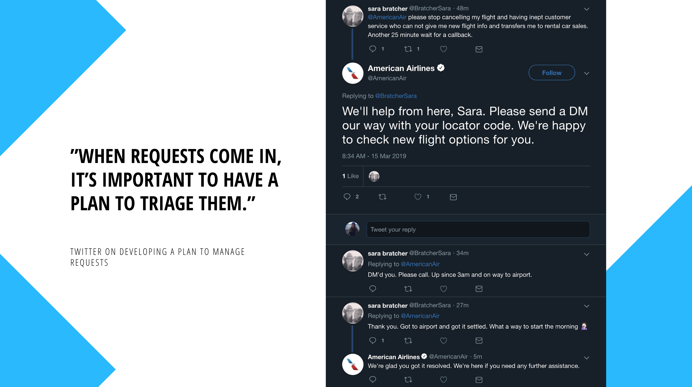
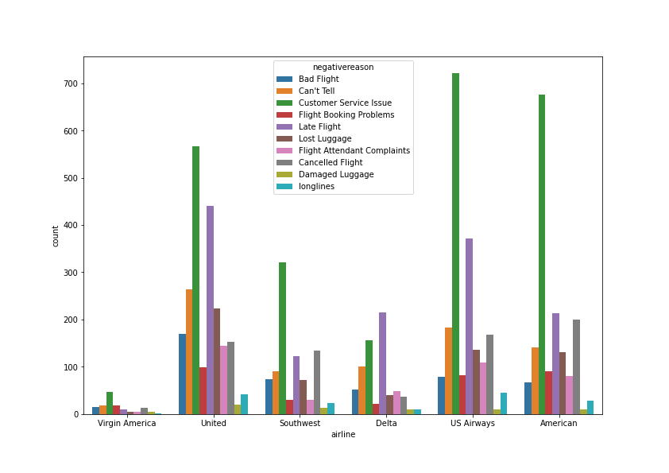

<a href="http://fvcproductions.com"></a>

# Customer Service Sentiment Prediction

> Predicting customer emotion in on-line service interactions. We look into the sentiment of customer service twitter messages directed toward the top U.S airlines. 
> Tags: Text Classification, Sentiment Analysis, NLP, NLTK, Scikitlearn

 

## Twitter Triage

When it comes to manaing customer service interactions on Twitter, the platfrom can be unforgiving. If your reps aren't equipped to handle customer demand, or aren't sure how to communicate on Twitter, it may harm your customer experience and lead your brand to receive upset followers. 

When requests come in through Twitter, it’s important to have a plan to triage them. The brands that are thriving in social customer care on Twitter (Amazon, Buffer, Starbucks, UPS) have common charactersitics where you'll find their replies to be prompt, unique, signed, and helpful. 

## Project Scenario

In any customer service scenario on Twitter, friendliness and personalisation are just as important as speed. Brands incorporating these practices into their Twitter customer service, often have positive results. 

With regard to speed, can we build a model that aids a team in decreasing the time needed to respond to an initial customer service message. We are using a dataset containing 14,000 customer service tweets labeled by emotional polarity data to speed response time for customer service tweets. 

## Project Struture

The data for this project is available in the following structore of the repo:
```
├── _data
│   ├── raw_data
│   │   ├── Tweets.csv
```
For now, we will use 80% of it as training set and the remaining 20% as the test set. They are both available in `/data/processed` as `train.csv` and `test.csv`. 

If you're more business oriented, I recommend viewing either the presentation pdf or the Readme for overlay and outcomes of the project. 

```
├── README.md 
```

```
├── Presentation.pdf
```

If on the technical side, please check out:

```
└───_code/
│       └───exploration/
│           │   01_data_exploration.ipynb
│       └───acquisition/
│           │   Feat_data.ipynb
│           │   Preprocessing.ipynb
│       └───modeling/
│           │   Modeling.ipynb
```

---
## Table of Contents (Readme)

> If your `README` has a lot of info, section headers might be nice.

- [Business Understanding](#business-understanding)
- [Project Scenario](#project-scenario)
- [Limitations](#limitations)
- [Project Goals](#project-goals)
- [Approach](#approach)
- [Data](#data)
- [EDA](#eda)
- [Modeling](#modeling)
- [Evaluation Metrics](#evaluation-metrics)
- [Next Step Future Work](#nextstep-futurwork)
- [References](#references)

---

## Business Understanding

For some people Twitter is the first place they go to for customer service. It may be about problems, complaints they need addressed, questions answered, or saying Thank You for service and support. Twitter's research has found that users are most likely to use Twitter as a customer service channel for retail and travel. As many as 40% of those who recently used the platform for customer service had done some for retail; 33% for travel and 28% for telecoms[1]. 

Twitter has found that 71% of Twitter users expect a brand to respond to their query within an hour of Tweeting. For most companies, this hasn't proven to be an issue. Twitter's study showed that 63% of users who Tweeted a brand about customer service had a response within an hour. Over a third of them had a response within 30 mins. It's imperative therfore for brands who don't have quick response times to develop systems in place to continously meet customer service demands. 

## Project Goals

(1) To better understand customer service sentiment of US airlines on TWitter.

(2) Develop a model that automatically detects customer emotional polarity in on-line service interactions with an accuracy of at least 90% and to show that good prediction is possible. 

## Approach

In this project, the target variable that represents the emotional parity is 'airline sentiment' which can be either negative, netural, or positive. I later turned the classification to binary as negative or positive to reduce noise generated from neutral. The data shrinks from it's original size of 14k to approximately 10k after re-classification. 
Tweets labeled as positive make up approximately 20 percent of the target variable. 
<br />
<br />

<br />
<br />

Once the text of a tweet is received, we want to create a model that predicts if the message is negative or positive so that we can automatically 
distinguish between high and low priority messages and delegate accordingly.  

Before we train a model, we need to perform pre-processing on the text and feature engineer  
said data to properly feed to our ML model for interpretation. A later section explains the process taken in fuller detail. 

## Data 

The data was scraped by CrowdFlower (now Figure Eight, a ML company) which includes all tweets and it's messages 
addressed at US airlines in the month of of February 2015. Human contributors then categorised each tweet according to 
the sentiment (positive, negative) from a crowsource marketplace. The dataset is hosted on Kaggle, 
https://www.kaggle.com/crowdflower/twitter-airline-sentiment. 

## EDA

### Missing values, outliers, low importance features? 
- Missing values count
- No outliers found
- Low importance features: 
    - `tweet_id`: no signifiance 
    - `airline_sentiment_gold`: unable to determine value.
    - `name`: no significance. 
    - `negativereason_gold`: unable to determine value.
    - `retweet_count`: less than 1% of tweets contain at least 1 retweet.
    - `tweet_coord`: little signifiance. 
    - `tweet_created`: time series is not being done.
    - `tweet_location`: little signifiance.  
    - `user_timezone`: little significance. 

### Negative Reasons by Airline 

The 'negative reasons' column of the dataset includes 10 different reasons of a label being labeled negative. If a labler labeled the tweet as being negative, they had the option of including a reason. Of the total 14k dataset, 5.4k messages include a negative reason. The negative reasons include: Bad flight, Can't tell, Customer service issue, Flight booking problems, Late flight, Lost luggage, Flight attendent complaints, cancelled flight, Damaged luggage, and longlines. 




#### Customer Service Issues

Four out of the six airlines have customer service as their most labeled negative sentiment. Without knowing further reasoning, it's difficult to ascertain the various types of customer service issues. We see that American Airlines and US Airways follow similar trend where CS issues has the largest screw all other ailines. 

#### Late Flight

Delta (and Virgin Airlines) is the only airline to have `Late Flight` as their most negative reason, with `Customer Service Issue` in a close tie for second to most negative reason. 

#### Longlines, Damaged Luggage

Both classifications garnered the lowest counts throughout all airlines suggesting it was not a source of problems for customers complaining online in the beginning of 2015.  

### Modeling 

Given that this is a classification problem, we have a number of algorithms we can choose from when approaching our model. Among the classifiers, we decide to fit the following models: 

- KNN
- Logistic Regression
- Linear SVM
- Decision Tree
- Random Forest
- Gradient Boosting

When doing feature engineering, we used both Bag of Words and TF-IDF. Bag of words counts how many times a word appears in a document or talliest the count. The words allow us to compare documents and guage the similarities for different applications. TF-IDF judges the topic of an article by the words it contains. Words are givent weight and measures relevance, not frequency. Word counts in other words, are replaced with TF-IDF scores across the dataset. 

We tested both Bag of Words and TF-IDF for each model to determine which algorithm of the two performs best. In the next section below we display the results of our findings. 

### Evaluation Metrics

The following metrics are the performance or scores of our models: 


|                     | Bag of Words | TF-IDF |
|---------------------|--------------|--------|
| KNN                 | 72%          | 91%    |
| Logistic Regression | 94%          | 94%    |
| Linear SVM          | 93%          | 95%    |
| Decision Tree       | 91%          | 89%    |
| Random Forest       | 92.47%       | 92.54% |
| Gradient Boosting   | 91.68%       | 91.57% |

The combination of model and feature engineering algorithm that performs best is the TF-IDF version of Linear SVM. We therefore select the Linear SVM TF-IDF as the model for deployment. 

### Next Step Future Work

- Include neutral as a classification.
- Adding new sentiment features for further understanding.
- Implement as an email routing tool.
- Continuous labeling of sentiment of tweets. 

### References 

[1] https://blog.twitter.com/en_gb/a/en-gb/2016/customer-service-on-twitter-and-the-impact-on-brands.html 
<br />
[2] https://business.twitter.com/en/blog/4-tips-for-providing-effective-customer-support-on-twitter.html
